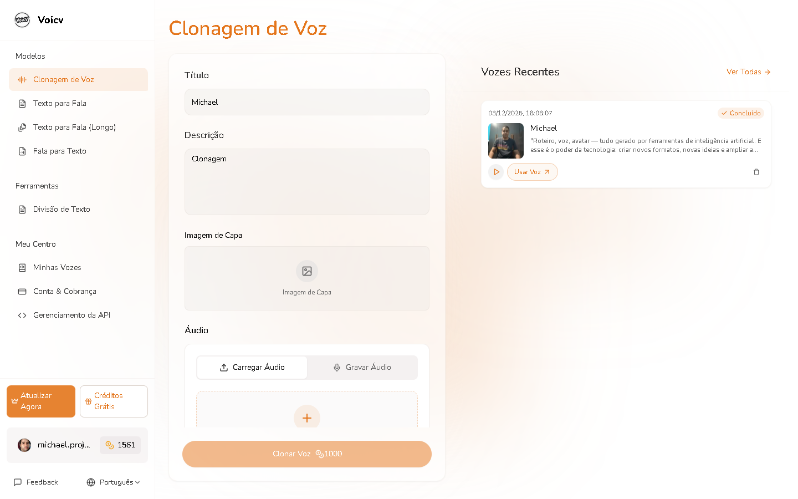
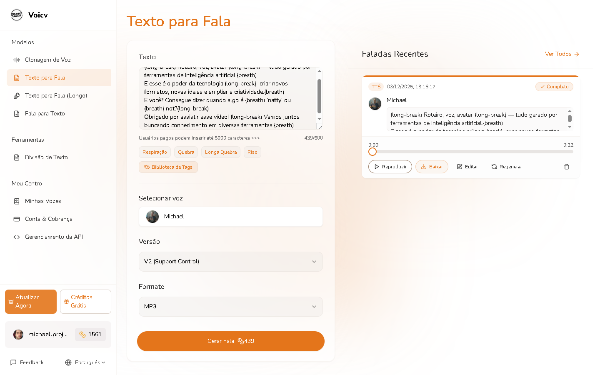
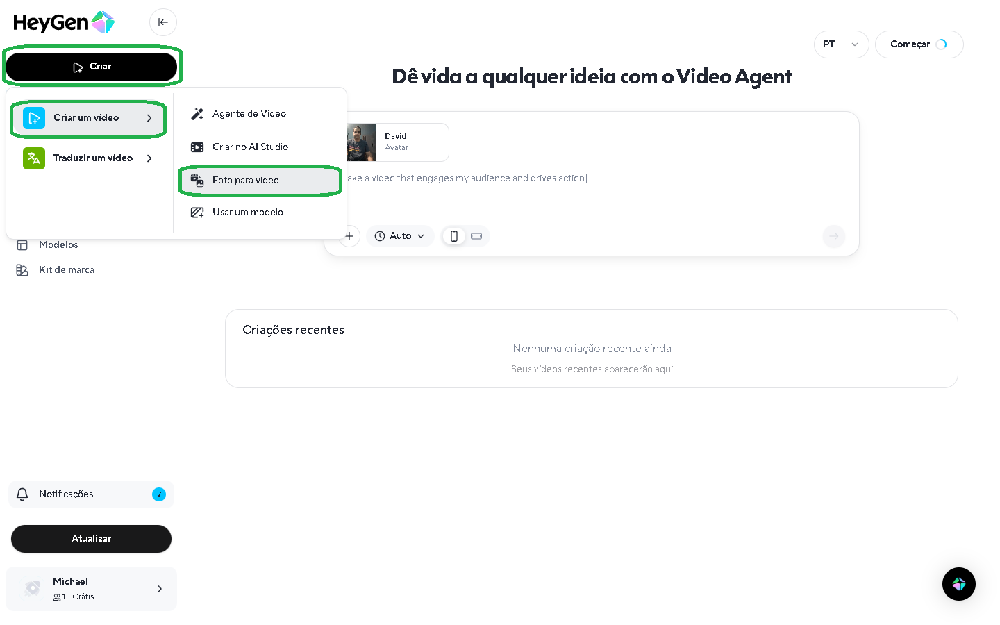
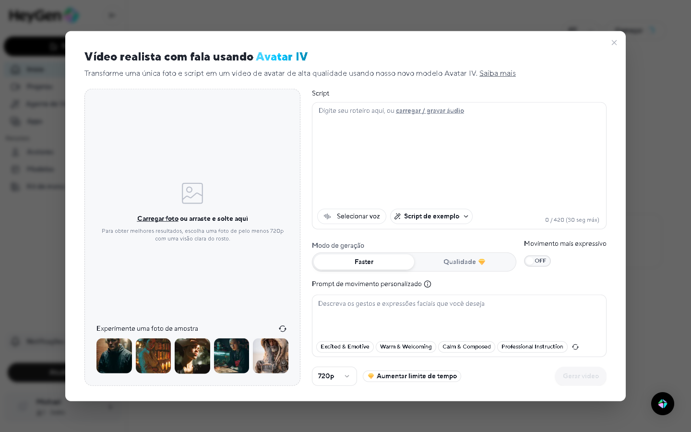

# 📝 Notas do Processo — Projeto Natty or Not

Este documento registra o processo de criação do vídeo utilizando IAs generativas.  

---

## 📌 1. Seleção da Foto

Escolhi uma foto com boa iluminação e um enquadramento frontal adequado para animação facial.

**Print do processo de criação:**

# Clonando a voz:
# É um processo que utiliza uma amostra de uma voz, no caso a minha, para a clonagem.
- Nesses campos basta colocar o título, a descrição, a imagem da capa e a amostra da voz ou se preferir você pode gravar o áudio.

#Texto para fala:
- Nesta tela basta colocar o texto que será falado pela IA, com opções de respiração, quebra ou riso; 
- Inserir abaixo o áudio que foi gravado na etapa de clonagem;
- Escolher a versão controle de áudio(V1 ou V2);
- Escolher o formato, poder ser com a extensão .wav ou .mp3 fica a critério de cada um;
- Por último clicar em "Gerar Fala" que irá gastar créditos da conta grátis, depois de terminado basta clicar em "Baixar".

#Criando o vídeo:
- Nesta tela basta clicar em Criar e Fotos para vídeo.

#Vídeo Realista:
- Nesta tela basta carregar a foto que pretende animar, inserir um texto para o script(mas neste caso o script se encontra no áudio gerado na eta de clonagem);
- O prompt é opcional, basta clicar em "Gerar vídeo" e aguardar o processo de criação para em seguida clicar em fazer o download.

